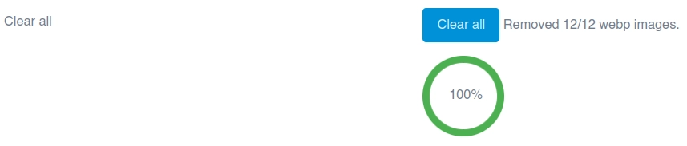
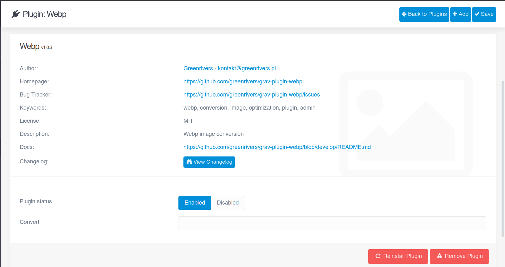

# Greenrivers Webp Plugin

The **Webp** Plugin is an extension for [Grav CMS](http://github.com/getgrav/grav).

It allows You to conversion images to webp extension.

## Installation

Installing the Webp plugin can be done in one of three ways:
- GPM (Grav Package Manager)
- manual method
- admin method

### GPM Installation (Preferred)

To install the plugin via the [GPM](http://learn.getgrav.org/advanced/grav-gpm), through your system's terminal (also called the command line),
navigate to the root of your Grav-installation, and enter:

    bin/gpm install webp

This will install the Webp plugin into your `/user/plugins`-directory within Grav. Its files can be found under `/your/site/grav/user/plugins/webp`.

### Manual Installation

To install the plugin manually, download the zip-version of this repository and unzip it under `/your/site/grav/user/plugins`.
Then rename the folder to `webp`. You can find these files on [GitHub](https://github.com/greenrivers/grav-plugin-webp) or via [GetGrav.org](http://getgrav.org/downloads/plugins#extras).

You should now have all the plugin files under

    /your/site/grav/user/plugins/webp

> NOTE: This plugin is a modular component for Grav which may require other plugins to operate,
> please see its [blueprints.yaml-file on GitHub](https://github.com/greenrivers/grav-plugin-webp/blob/master/blueprints.yaml).

### Admin Plugin

If you use the Admin Plugin, you can install the plugin directly by browsing the `Plugins`-menu and clicking on the `Add` button.

## Requirements

Make sure that You have installed and enabled webp support:

- install system packages: libwebp-dev, webp
- enable GD and configure PHP to enable support for webp format
- install & enable PHP Exif extension

## Configuration

Before configuring this plugin, you should copy the `user/plugins/webp/webp.yaml` to `user/config/plugins/webp.yaml` and only edit that copy.

Here is the default configuration and an explanation of available options:

```yaml
enabled: true
original_path: 0
quality: 100
```

Note that if you use the Admin Plugin, a file with your configuration named webp.yaml will be saved in the `user/config/plugins/`-folder once the configuration is saved in the Admin.

## Usage

#### Plugin config

1. Original path
    - Enable to save the webp image in the same directory as the original image
    - Disable to save the webp image in the user/webp directory


2. Quality
    - Set up value on slider range
    - Quality percent value is displayed below the slider


3. Conversion
   - Click on **Convert** button from plugin settings in admin menu.
   - Info about number of the converted images appears next to the **Convert** button.


4. Clear all
    - Click on **Clear all** button from plugin settings in admin menu.
    - Info about number of the removed webp images appears next to the **Clear all** button.



#### Console commands

1. Convert to webp format

- image by given path

```shell
php bin/plugin webp convert --path=<path_to_image> [--original_path=<1,0>] [--quality=<quality>] [--overwrite]
```

- all images

```shell
php bin/plugin webp convert --all [--original_path=<1,0>] [--quality=<quality>]
```

2. Clear

- webp image by given path

```shell
php bin/plugin webp clear --path=<path_to_image>
```

- all webp images

```shell
php bin/plugin webp clear --all
```

#### Notes

Plugin supports following extensions:

- jpg
- jpeg
- png

Better quality causes bigger image size.

<ins>After conversion You must clear cache.</ins>

To display converted image use **webp** filter in twig templates.

### Examples:

Raw image url.

```html

```

Source from variable.

```html

```

### Issues:

Sometimes after plugin activation You can see text field instead of button & progressbar.<br/>
To resolve it, save config again with **Enabled** status.



## Testing

Run unit tests from root plugin path (**user/plugins/webp**):

```
php vendor/bin/codecept run unit
```

## Credits

https://www.php.net/manual/en/image.installation.php

https://developers.google.com/speed/webp

## ToDo

- [x] Create **Clear all** option
- [x] Create image quality option
- [x] Add console commands
- [x] Add unit tests
